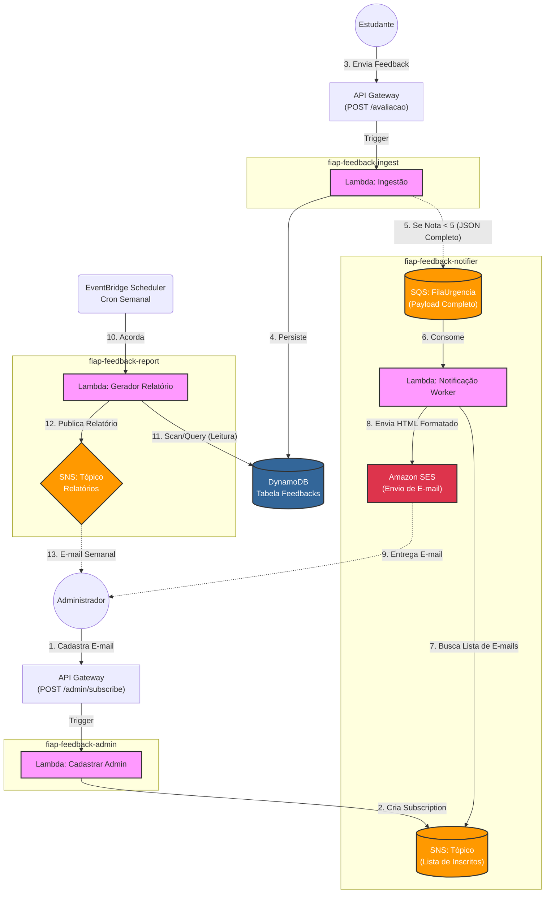

# FIAP Feedback Report Generator

Este repositório contém o microsserviço de **Geração de relatórios** da plataforma de Feedback. Ele é responsável por gerar o arquivo PDF com o relatório semanal, salvando-o em um bucket S3.

## 📋 Visão Geral

O serviço opera em arquitetura **Serverless** utilizando AWS Lambda e Quarkus. Ele consome recebidas pela lambda report-data-collector (dentro de um fluxo de step functions), prepara um arquivo de relatório PDF com as informações fornecidas e envia para um bucket S3.

### Arquitetura da Solução



## 🚀 Tecnologias Utilizadas

*   **Java 17**: Linguagem de programação.
*   **Quarkus**: Framework Java Supersônico e Subatômico para microsserviços.
*   **AWS SAM (Serverless Application Model)**: Para IaC (Infraestrutura como Código) e deploy.
*   **AWS Lambda**: Computação serverless.
*   **Amazon S3**: Bucket para armazenamento de arquivos PDF gerados pela lambda.

## ⚙️ Pré-requisitos

*   Java 17 instalado.
*   Maven instalado.
*   AWS CLI configurado com suas credenciais.
*   AWS SAM CLI instalado.
*   Docker (opcional, para testes locais).

## 📦 Como Fazer o Deploy

1.  **Compile o projeto:**
    ```bash
    .\mvnw.cmd clean package -DskipTests
    ```

2.  **Execute o deploy guiado com base no `samconfig.toml` já existente:**
    ```bash
    sam deploy
    ```
## 🧪 Como Testar

Como este serviço faz parte de uma step function, ele não possui um endpoint HTTP direto. Para testá-lo, você deve iniciar a state machine `WeeklyReportStateMachine` para iniciar o fluxo completo (coleta de informações, geração de PDF e envio de relatório).

Outra alternativa é executar a lambda diretamente fornecendo as informações necessárias para que ele gere um PDF no input
**Exemplo de Payload (para utilizar na state machine):**
```json
{
  "reportType": "weekly",
  "timezone": "America/Sao_Paulo",
  "note": "Relatório semanal de urgência"
}

```

**Exemplo de Payload (para utilizar diretamente na lambda):**
```json
{
  "feedbacks": [
    { "id": 1, "message": "Sistema lento", "urgency": "alta", "date": "2025-12-10" },
    { "id": 4, "message": "Sistema não funciona corretamente", "urgency": "alta", "date": "2025-12-10" },
    { "id": 2, "message": "Interface confusa", "urgency": "media", "date": "2025-12-11" },
    { "id": 3, "message": "Interface feia", "urgency": "baixa", "date": "2025-12-12" }
  ],
  "countByDay": {
    "2025-12-10": 1,
    "2025-12-11": 1,
    "2025-12-12": 1
  },
  "countByUrgency": {
    "alta": 2,
    "media": 1,
    "baixa": 1
  }
}

```
**Desenvolvido para o Tech Challenge da FIAP - Fase de Cloud Computing & Serverless.**
