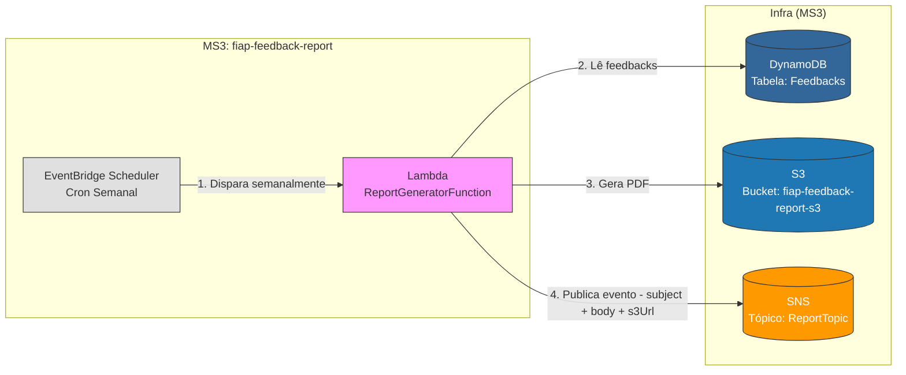

# FIAP Feedback Report Generator

Este repositório contém o microsserviço de **Geração de relatórios** da plataforma de Feedback. 
Ele é responsável por gerar o arquivo PDF com o relatório semanal, buscando as informações no DynamoDB e salvando-o em um bucket S3.

## 📋 Visão Geral

O serviço opera em arquitetura **Serverless** utilizando AWS Lambda e Quarkus. 
Ele consome o evento enviado pelo event bridge, busca as informações de Feedbacks da semana anterior no DynamoDB, prepara um arquivo de relatório 
PDF com as informações fornecidas e envia para um bucket S3. Por fim, ele publica uma mensagem no tópico SNS para ser consumido pelo serviço de e-mail, contendo o título, o corpo da mensagem e o link para o arquivo no bucket S3

### Arquitetura da Solução



## 🚀 Tecnologias Utilizadas

*   **Java 17**: Linguagem de programação.
*   **Quarkus**: Framework Java Supersônico e Subatômico para microsserviços.
*   **AWS SAM (Serverless Application Model)**: Para IaC (Infraestrutura como Código) e deploy.
*   **AWS Lambda**: Computação serverless.
*   **Amazon S3**: Bucket para armazenamento de arquivos PDF gerados pela lambda.

## ⚙️ Pré-requisitos

*   Java 17 instalado.
*   Maven instalado.
*   AWS CLI configurado com suas credenciais.
*   AWS SAM CLI instalado.
*   Docker (opcional, para testes locais).

## 📦 Como Fazer o Deploy

1.  **Compile o projeto:**
    ```bash
    .\mvnw.cmd clean package -DskipTests
    ```

2.  **Execute o deploy guiado com base no `samconfig.toml` já existente:**
    ```bash
    sam deploy
    ```
## 🧪 Como Testar

Como este serviço é iniciado pelo trigger de Event Bridge, ele não possui um endpoint HTTP direto. 
Para testá-lo, Você deve ajustar o cron do template.yaml localizado em ReportGeneratorFunction > Events > WeeklySchedule > Properties > Schedule.
Colocando um período testável (por exemplo a cada 5 minutos).

Outra alternativa é executar a lambda diretamente fornecendo as informações necessárias para que ele gere um PDF no input

Das duas formas, você precisa ter registros de feedbacks para que a função busque por esses feedbacks e monte o PDF

**Exemplo de Payload (para utilizar diretamente na lambda):**
```json
{
  "reportType": "relatorio-semanal"
}

```
**Desenvolvido para o Tech Challenge da FIAP - Fase de Cloud Computing & Serverless.**
